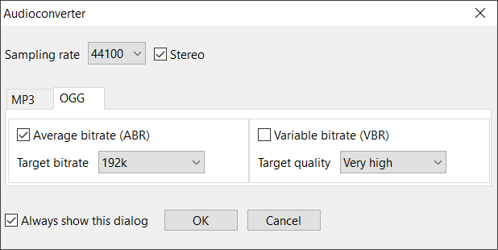

# WCX Audioconverter
Audioconverter packer plugin for Total Commander (32/64-bit version)

This plugin is inspired by Plotn's [32-bit audioconverter](https://totalcmd.net/plugring/wcx_plugin_BitRate_Converter_0.html) module. Currently it supports only the most basic audio conversion functions as a proof of concept. Internally Audioconverter uses [SoX processor](http://sox.sourceforge.net/).

Supported formats: CDDA, CDR, FLAC, GSM, MP2, MP3, OGG, WAV. Optional volume normalization is also available:



The plugin converts selected files and folders, optionally preserving folder structure. Files with unknown extensions are ignored.

# Installation
The binary plugin archive comes with the setup script. Just enter the archive, and confirm installation.

# Development
The plugin has to be tested more thoroughly. Also we should add support for more file formats and format options. Contributions are welcome.

The settings dialog is implemented in [wxWidgets](https://www.wxwidgets.org/). It is presumed that the library is located in `%SHAREDLIBS_ROOT%\wxWidgets_3_1_0`.

Default setup scripts of wxWidgets provide 32-bit version of the library only. To build a 64-bit version, use the following commands:

```
cd /d "%SHAREDLIBS_ROOT%\wxWidgets_3_1_0\build\msw"
"%VCINSTALLDIR%\Auxiliary\Build\vcvarsall.bat" x64
nmake /f makefile.vc TARGET_CPU=X64 RUNTIME_LIBS=static BUILD=release
nmake /f makefile.vc TARGET_CPU=X64 RUNTIME_LIBS=static
```

To build Audioconverter, execute `BuildMakeSetup.bat`.